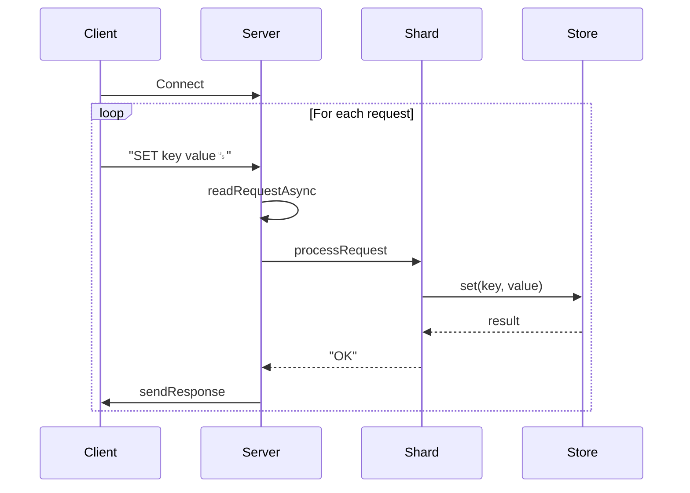
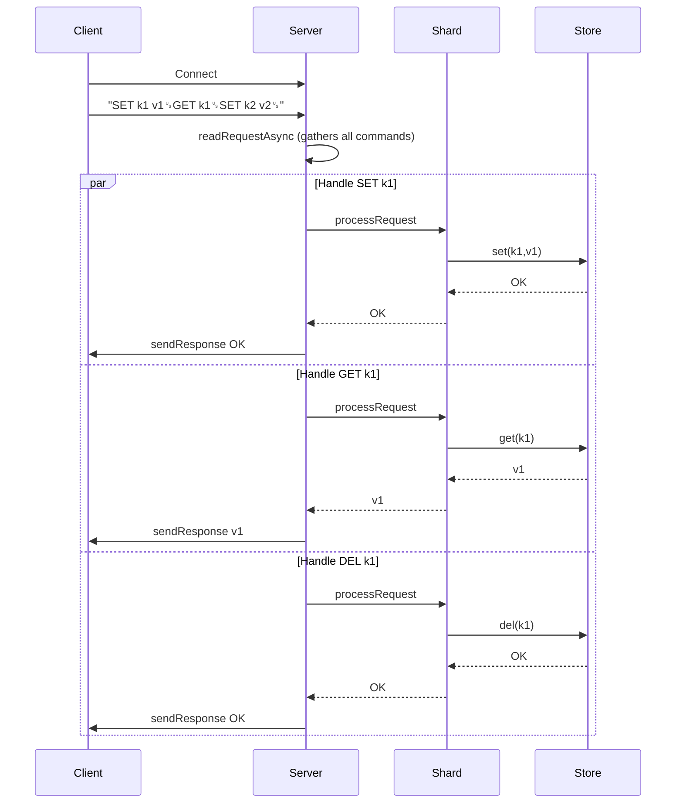
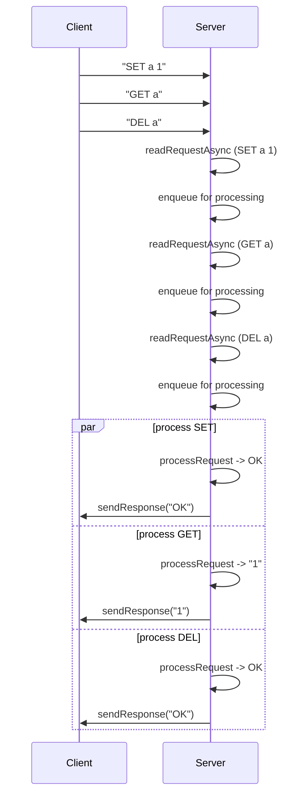

# Design doc

## High level

```mermaid
graph TD
    A[TCP Client] --> B[ConnManager::acceptConnections]
    B --> C[epoll_wait loop]
    C -->|ready fd| D[readRequestAsync]
    D --> E[processRequest]
    E --> F[ServerShard::processCommand / processQuery]
    F --> G[KeyValueStore]
    E --> H[sendResponse]
    C --> I[metricsUpdaterThread] --> J[MetricsServer]
```

## Requests flow

### Current

```mermaid
sequenceDiagram
    participant Client
    participant Server
    participant Shard
    participant Store

    Client->>Server: Connect
    loop For each request
        Client->>Server: "SET key value␟"
        Server->>Server: readRequestAsync
        Server->>Shard: processRequest
        Shard->>Store: set(key, value)
        Store-->>Shard: result
        Shard-->>Server: "OK"
        Server->>Client: sendResponse
    end
```

### Pipelining (TODO)

#### Concept

```mermaid
sequenceDiagram
    participant Client
    participant Server
    participant Shard
    participant Store

    Client->>Server: Connect
    Client->>Server: "SET k1 v1␟GET k1␟SET k2 v2␟"
    Server->>Server: readRequestAsync (gathers all commands)
    par Handle SET k1
        Server->>Shard: processRequest
        Shard->>Store: set(k1,v1)
        Store-->>Shard: OK
        Shard-->>Server: OK
        Server->>Client: sendResponse OK
    and Handle GET k1
        Server->>Shard: processRequest
        Shard->>Store: get(k1)
        Store-->>Shard: v1
        Shard-->>Server: v1
        Server->>Client: sendResponse v1
    and Handle DEL k1
        Server->>Shard: processRequest
        Shard->>Store: del(k1)
        Store-->>Shard: OK
        Shard-->>Server: OK
        Server->>Client: sendResponse OK
    end
```

#### Flow example

```mermaid
sequenceDiagram
    participant Client
    participant Server
    Client->>Server: "SET a 1"
    Client->>Server: "GET a"
    Client->>Server: "DEL a"
    Server->>Server: readRequestAsync (SET a 1)
    Server->>Server: enqueue for processing
    Server->>Server: readRequestAsync (GET a)
    Server->>Server: enqueue for processing
    Server->>Server: readRequestAsync (DEL a)
    Server->>Server: enqueue for processing
    par process SET
        Server->>Server: processRequest -> OK
        Server->>Client: sendResponse("OK")
    and process GET
        Server->>Server: processRequest -> "1"
        Server->>Client: sendResponse("1")
    and process DEL
        Server->>Server: processRequest -> OK
        Server->>Client: sendResponse("OK")
    end
```