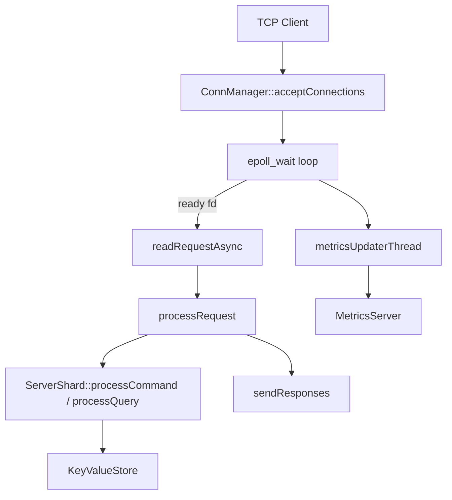
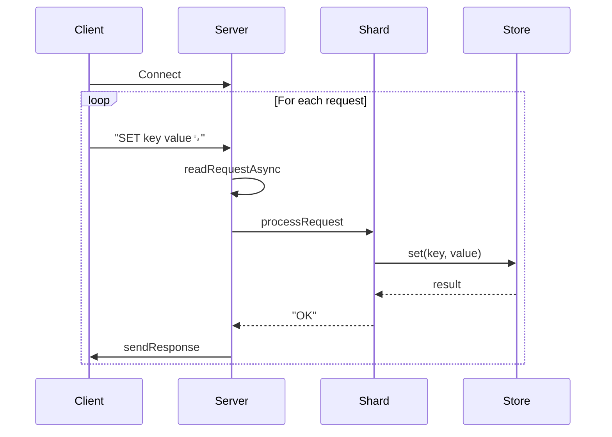
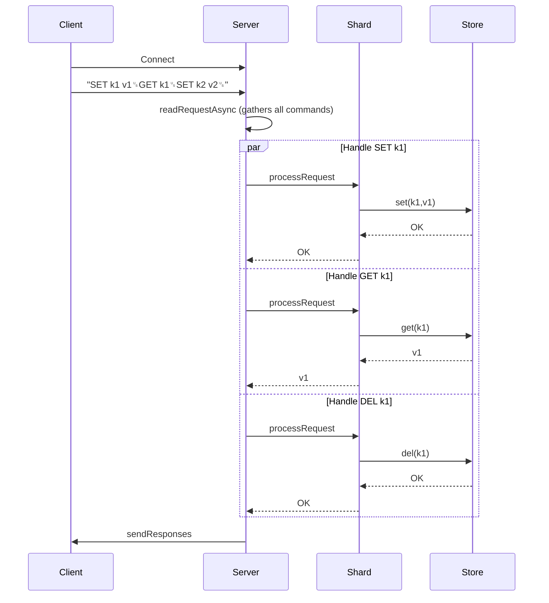
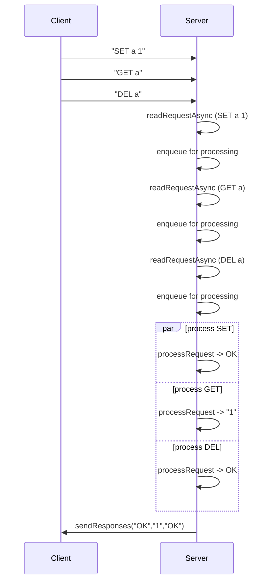

# Design doc

## High level

## Requests flow

### Current

### Pipelining

#### Concept

#### Flow example

### Performance improvements

Recent optimizations reduced the number of syscalls in pipelined mode. Requests
from a single connection are now processed in batches and all replies are sent
using `sendResponses`. With this approach the server reaches more than
**1 500 000** RPS for GET/DEL requests, over **1 000 000** RPS for SET and around
**3 000 000** RPS for the "SET key, GET key, GET non_existent_key" workflow on a
high‑end Linux machine.
